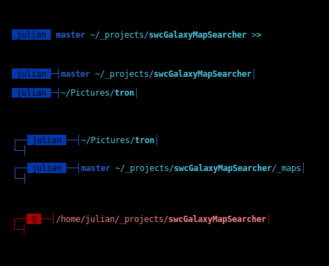

#### LINUX
## BASH

This is setting for bash. Copy to your HOME.

---

## Prompt

Here are choices which you enable in **.bashrc** inside set_prompt().
In case no need GIT info just comment first line which contain it in parse_prompt().



### Bashupdate.sh

Updates all profiles with this set. Copies files with dot thru all users includes root.

## Aliases
#### Variables

- SH_MSX :: sets working directory for **m**
- SH_MSXPLAYER :: choose wich player to use **tizonia|mocp**
- SH_JPGRE :: sets default % of resize for **jpgre**
- SH_SPIN :: sets spin sequence for progress **jpgre** and **psd2jpg**

#### COMMON
- ll :: same as above but as expanded
- l :: list entires as columns and with indicator
- l. :: list hidden (begins with dot)
- ip :: just add colors
- dff :: shows all /dev/sd* usage
- dus :: shows usage for all directories on actual level
- cp :: uses rsync for copy
- hist :: use grep phrase on .bash_history

#### APT
- i :: install package with yes agree on
- I :: reinstall package
- s :: list repos
- S :: show given package
- r :: remove package with yes agree on
- u :: execute full update (but no distro), regular update, checking kept back with safe update, safe nvidia update, clean dpkg and snaps

##### GFX
- psd2jpg :: convert all .psd to .jpg in current folder
- jpgre :: resize all .jpg which was not scaled to given number of % width/higth // arg with number change % of resize
- pdf2pdf :: separate multi page PDF to single pages (numbered 0000, 0001 ...)
- doc2pdf :: convert to PDF any document openable by LibreOffice (version is checked >= 5.2.6.2)

##### VIDEO
- ffavi :: convert any video to H.264/mkv crf/20 and audio mp3/48000Mhz/128k

#### MSX
- m :: play content of folder given as arg // no args list entries // arg '--' list entries of folder given as second arg
1. TIZONIA
- ms :: tizonia audio search
- ml :: tizonia audio playlist
2. MOCP (in case config set on file **chmod g-r,o-r**)
- ms :: toggle PAUSE
- mS :: toggle PLAY/STOP
- mx :: start mocp server, if stoped and playlist then playit, enter GUI
- mX :: shutdown mocp server
- mn/mp :: next/previous track

##### TOOLS
- sc :: shellcheck on bash with warrnings and errors only
- nmap :: with prepend sudo
- e :: empty will shows all executables scripts invoked SheBang (#!), or execute
- tm :: change access and modification datetime with arg YYYYMMDDhhmm. Changes with only provided part of arg.
- kc :: sync Keepass file local-remote with autochange detection (separate project)
- psk :: shows collected wifi passwords
- findusb :: determine usb port of device
- ddw :: write IMG to (USB) drive, exp. ddw sde raspberry.img
- ddc :: clear (USB) drive, exp. ddc sde

#### EDITOR
- vi :: neovim
- na :: nano
- mi :: micro

### Unbundled
Contains full and prettified some scripts of above aliases.
- e
- findusb : findusbports
- jpgre
- tm
- u : update
- swap.sh : not aliased script for creating and/or changing /swapfile

### Convert and problem with cache
> Source from [HERE](https://stackoverflow.com/questions/31407010/cache-resources-exhausted-imagemagick#62512452)

The error probably occurs because you run out of memory. You can check for the resources using the following command:
**convert -list resource**

The output will be somewhat like this:
```
Resource limits:
  Width: 16KP   
  Height: 16KP   
  Area: 128MP   
  Memory: 256MiB   
  Map: 512MiB   
  Disk: 1GiB   
  File: 768   
  Thread: 8   
  Throttle: 0   
  Time: unlimited
```
Here, you can see that the assigned amounts of disk space and memory are very small. So, in order to modify it you need to change the policy.xml file located somewhere in /etc/ImageMagick-6 directory. Use command **find / -name "policy.xml"** to locate.

Change in the **policy.xml** file.
```
<policy domain="resource" name="disk" value="1GiB"/>
```
to
```
<policy domain="resource" name="disk" value="4GiB"/>
```

## BASH.TERMUX
Copy to your HOME under Termux on your Android device.

### Installation

1. download files to device
2. run Termux
3. execute commands (first command only once):
    ```
    termux-setup-storage
    pkg update && pkg install python git rclone zip unzip wget
    ```
4. download file and copy
    ```
    cp ./storage/downloads/bashrc_termux ./.bashrc
    ```
    OR
    ```
    curl https://github.com/exa18/shell-scripting/raw/main/linux/bash/termux/bashrc_termux > .bashrc
    ```
    OR
    ```
    wget https://github.com/exa18/shell-scripting/raw/main/linux/bash/termux/bashrc_termux
    cp bashrc_termux .bashrc
    ``` 
5. restart shell: **exec bash**
